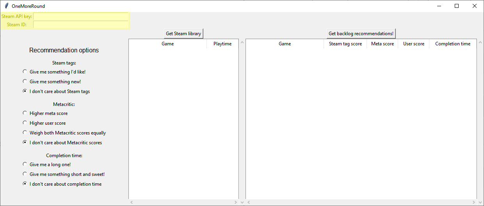
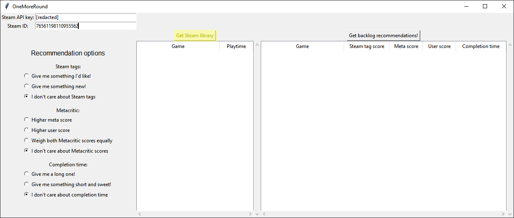
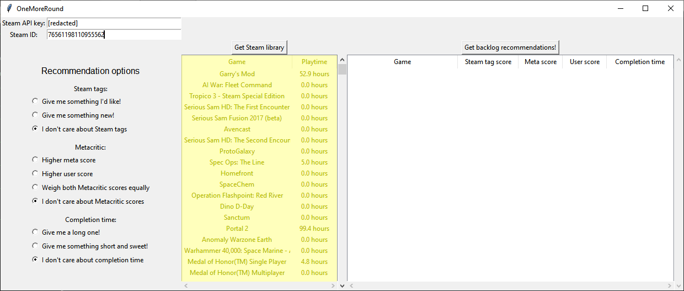
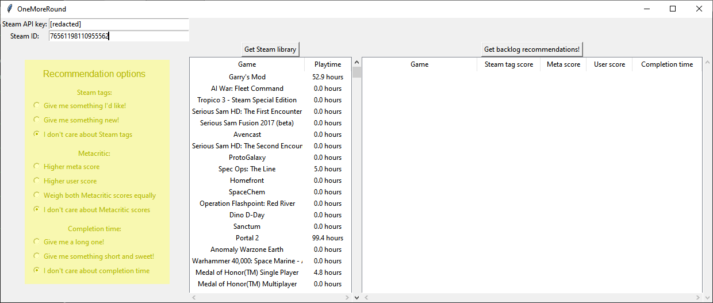
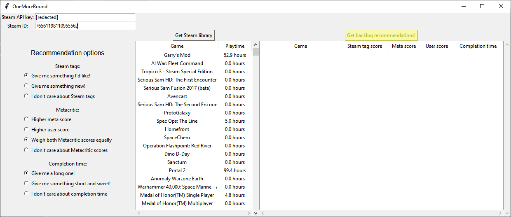
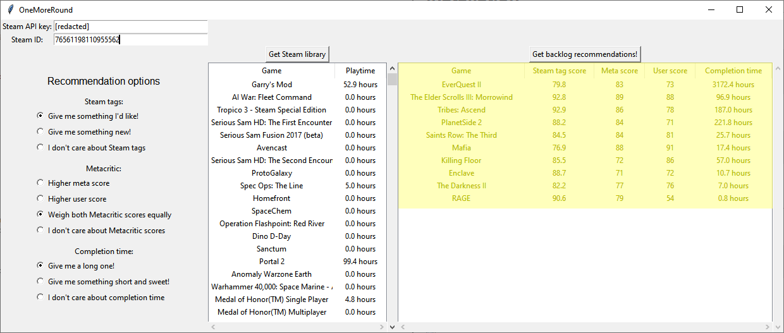

# OneMoreRound

OneMoreRound is a game backlog recommendation engine, implemented in Python.

## Features

* Recommendation algorithm based on Steam tags and playtime
* Integration with Metacritic for aggregate review and user scores 
* Integration with HowLongToBeat for game completion times
* Easy-to-use graphical interface

## Installation

Clone this repository:

```
>> git clone https://github.com/jamesjiang52/OneMoreRound.git
>> cd OneMoreRound
```

Then install the required Python packages:

```
>> pip install -r requirements.txt
```

## Usage

Run:

```
./onemoreround.sh
```

A GUI will open. First, fill in your Steam API key and Steam ID in their corresponding fields. For details on obtaining these, consult [this](https://steamcommunity.com/dev) and [this](https://help.steampowered.com/en/faqs/view/2816-BE67-5B69-0FEC).



Click on the "Get Steam library" button to fetch your Steam library. Your games (both played and unplayed) will be displayed in the below window.





Next, select some recommendation options. There are various options for Steam tags, Metacritic scores, and game completion times.



Finally, click on the "Get backlog recommendations" button to generate a list of recommendations, which will be displayed in the below window.





Note that generating the recommendations will take a few seconds to several minutes, depending on the size of your library. This is just due to the large number of requests sent to Steam, Metacritic, and HowLongToBeat. I suggest going and making yourself a cup of coffee if your library is larger than, like, [30](https://tenor.com/view/rookie-numbers-gif-26135237) games.

Also note that, for simplicity and ease of implementation, if a game does not have Metacritic or HowLongToBeat entries, they will never be recommended.

## License

See [LICENSE](LICENSE).